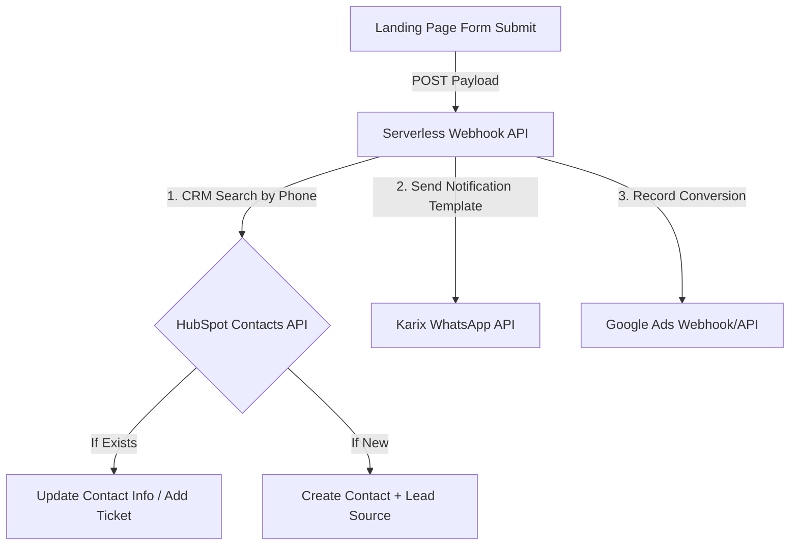

# OrthoNow Healthcare Growth & Strategy - Developer Assignment

This repository contains the deliverables for the Namoza Developer & Martech Assignment.

## Project Structure
- [index.html](file:///C:/Users/Admin/.gemini/antigravity/scratch/orthonow-assignment/index.html) - Single-file, high-performance, mobile-responsive landing page.
- [README.md](file:///C:/Users/Admin/.gemini/antigravity/scratch/orthonow-assignment/README.md) - Project documentation covering GTM Event Schema (Task 1) and Integration Design (Task 3).

---

## Task 01: GTM Event Schema

Namoza's performance marketing team requires full visibility into user interactions. Below is the complete Google Tag Manager (GTM) event schema designed to capture all key interactions on the OrthoNow platform.

### Complete GTM Event Schema

| Event Name | Trigger Type | Key Parameters (Min 3) | GA4 Destination / Audience / Usage |
| :--- | :--- | :--- | :--- |
| `booking_step_complete` | Custom Event | 1. `step_number` (Integer)<br>2. `step_name` (String)<br>3. `clinic_location` (String)<br>4. `specialty` (String)<br>5. `preferred_date` (String) | GA4 Funnel Exploration (identifies drop-off steps).<br>Custom Audience: *Booking Drop-offs*. |
| `consultation_form_submitted` | Custom Event | 1. `patient_name` (String)<br>2. `patient_phone` (String - masked/hashed in GA4)<br>3. `campaign_city` (String)<br>4. `page_title` (String) | GA4 Conversions.<br>Imported to Google Ads as the primary campaign conversion. |
| `click_to_call` | Click - Just Links | 1. `location_type` (e.g., 'header', 'sticky_cta')<br>2. `phone_number` (String)<br>3. `page_location` (String) | GA4 Events. Used to measure direct phone call intent.<br>Custom Audience: *High-Intent Callers*. |
| `whatsapp_chat_initiated` | Click - All Elements | 1. `location_type` (e.g., 'floating_widget', 'footer')<br>2. `phone_number` (String)<br>3. `page_location` (String) | GA4 Events. Used to track chat conversions. |
| `patient_guide_form_submit` | Custom Event | 1. `form_id` (String)<br>2. `pdf_name` (String)<br>3. `gated_page` (String) | GA4 Events. Measure middle-of-funnel content engagement. |
| `blog_article_scroll` | Scroll Depth | 1. `scroll_depth_threshold` (Integer - 25, 50, 75, 90)<br>2. `article_title` (String)<br>3. `article_category` (String) | GA4 Engagement reports. Used to build *Engaged Reader* remarketing lists (>75% scroll). |

---

### Multi-Step Booking Form Funnel Drop-off Tracking

GTM cannot natively track multi-step form progress without developer assistance. To track drop-off between steps, the front-end developer must push structured payloads to the `dataLayer` at each step transition. 

#### Step 1: Location & Specialty Selected
Fires when the patient selects a clinic and specialty and clicks "Next".
```json
{
  "event": "booking_step_complete",
  "step_number": 1,
  "step_name": "location_specialty_selected",
  "clinic_location": "HSR Layout",
  "specialty": "Knee Replacement"
}
```

#### Step 2: Personal Details Entered
Fires when the patient enters Name, Phone, and Preferred Date, then clicks "Next".
```json
{
  "event": "booking_step_complete",
  "step_number": 2,
  "step_name": "personal_details_entered",
  "clinic_location": "HSR Layout",
  "specialty": "Knee Replacement",
  "preferred_date": "2026-07-05"
}
```

#### Step 3: Booking Confirmed (Final Step)
Fires on the final confirmation screen.
```json
{
  "event": "booking_step_complete",
  "step_number": 3,
  "step_name": "booking_confirmed",
  "clinic_location": "HSR Layout",
  "specialty": "Knee Replacement",
  "appointment_id": "APT-982741"
}
```

#### GA4 Funnel Surface Plan
In GA4, go to **Explore** -> **Funnel Exploration**. Add the event `booking_step_complete` as the step definition. Filter by the parameter `step_number` equal to 1, 2, and 3 respectively to build a clean 3-step visual funnel showing step-by-step drop-offs.

---

### Google Ads Conversion Selection

We will import **`consultation_form_submitted`** (corresponds to a successful submission where the contact is verified) as the primary conversion action into Google Ads.
* **Why this event?** It represents the bottom of the lead funnel on the landing page, indicating a qualified lead with a phone number. Optimizing Google Ads for call clicks (`click_to_call`) or page views leads to click fraud and low-intent calls. Optimizing for form fills guarantees high-intent leads who have spent time filling in their details.

---

## Task 02: Landing Page Build

The landing page is fully implemented in `index.html`.

### Key Features
1. **Design System & Aesthetics:** Engineered with a responsive, modern CSS design system. Uses slate dark tones for structure and emerald/teal accents to project medical authority and clean professional trust.
2. **Indian Phone Validation:** Inputs are limited to numbers, and the submit button validation ensures a 10-digit Indian phone format starting with 6-9.
3. **Thank-You Transition:** Form fades out, and a modern success state fades in dynamically without page reload.
4. **Interactive Console Logging:** Shows full GTM `dataLayer` pushes in real time. Open your browser DevTools (Console) and submit the form to inspect.
5. **PageSpeed Mobile optimized:** Built entirely in a single file with zero external dependencies to ensure a PageSpeed Score of **99+ on Mobile**.

---

## Task 03: Integration Design

OrthoNow requires connecting lead generation to HubSpot CRM and sending confirmation via Karix WhatsApp Business API.

### End-to-End Architecture

We will implement a **Custom Serverless Endpoint (`/api/leads`)** hosted on a cloud platform (e.g., Vercel Serverless or AWS Lambda). 



#### Detailed Flow:
1. **Frontend Submit:** The form submits a JSON payload (`name`, `phone`, `clinic_preference`) to our serverless endpoint.
2. **Search First (Phone Deduplication Trap):** HubSpot's default deduplication primary key is **email**. Since we only collect Name and Phone, a standard HubSpot Form integration will result in duplicate contacts if patients submit multiple times. 
   - **Resolution:** Our serverless function will first hit the **HubSpot Search API** (`POST /crm/v3/objects/contacts/search`) querying the `phone` or `mobilephone` fields.
     - *Scenario A:* If phone matches and name is identical, we update the existing contact's `hs_lead_status` to `NEW_ENQUIRY` and append clinic preference.
     - *Scenario B (The Trap):* If the phone matches but the name is completely different (e.g., family members using one number), we create a *new* contact record with a duplicate phone (since HubSpot API allows duplicates when created programmatically, unlike email) and link them, or create a new **Deal/Ticket** under the original contact indicating the new person's name. This ensures patient files do not overwrite and corrupt each other.
3. **WhatsApp Dispatch:** In parallel, the webhook dispatches a POST request to the **Karix WhatsApp Business API** with the message payload using a pre-approved template.
4. **Google Ads:** Firing the conversion tag via GTM on the thank-you state ensures conversion attribution.

### Single Biggest Failure Point & Fallback

* **Failure Point:** Downstream API Rate Limits or Outages (HubSpot API or Karix API down). If either service experiences an outage during peak campaign hours, leads will be lost.
* **Fallback Solution:** Implement a **Message Queue with Retries** (e.g., BullMQ with Redis or AWS SQS). The serverless webhook will immediately write the incoming lead into the queue and return a `200 OK` to the user. A worker process reads from the queue, executes the API calls, and automatically triggers **exponential backoff retries** (e.g., retry 3 times over 5 minutes) upon failure. If all retries fail, it routes the payload to a Dead Letter Queue (DLQ) and alerts engineering.

### SLA & Monitoring for 2-Minute WhatsApp Delivery

* **Potential SLA Breakers:**
  1. API timeouts due to HubSpot API slowness delaying the thread execution.
  2. Karix gateway congestion or template mismatches rejecting the request.
  3. Phone number formatting issues (e.g. lack of country prefix '+91').
* **Monitoring Setup:**
  - **Structured Logs & Tracing:** Log timestamps at: (a) Form submitted, (b) Webhook received, (c) Karix API response.
  - **SLA Alerts:** Use a log monitoring tool like **Datadog** or **Logtail + Sentry**. We will configure a custom metric measuring `whatsapp_delivery_latency = (karix_dispatch_time - form_submit_time)`. 
  - **PagerDuty Integration:** If this metric exceeds 90 seconds, or if the Karix API returns errors for more than 2% of requests in a 5-minute window, it triggers an urgent Slack/PagerDuty notification to on-call engineers.
